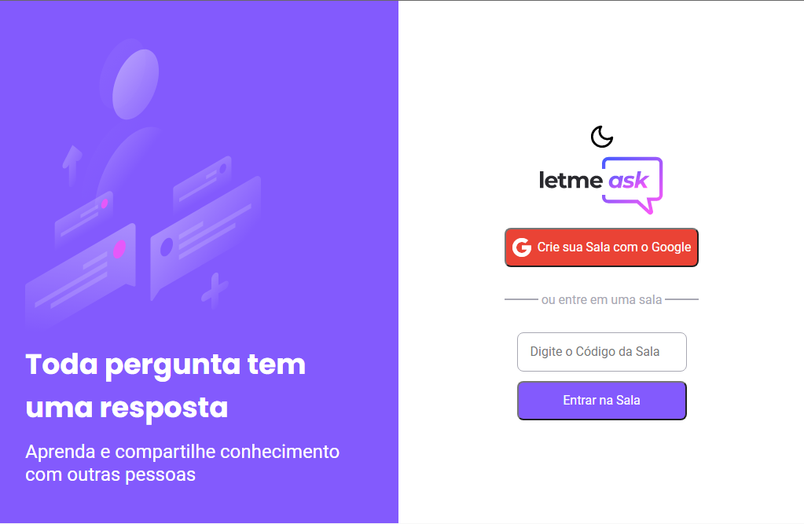

<h1 align="center">
    
    <br>
 </h1>
 <p align="center">
  <a href="#sobre-o-projeto">Sobre o Projeto</a> |
  <a href="#tecnologias">Tecnologias</a> | 
  <a href="#pré-requisitos">Pré-Requisitos</a>   |
  <a href="#executando-a-aplicação">Executando a aplicação</a>   |
  <a href="#funções-do-sistema">Funções do Sistema</a>   |
  <a href="#link-produção">Link Produção</a>   
</p> 

## Sobre o Projeto
Letmask é um projeto desenvolvido na edição do NLW 6 da Rocketseat.
 
O projeto consiste em um ambiente onde pode-se criar salas onde os usuários conectados podem fazer perguntas para o administrador da sala. Tem como cenário para sua utilização, a transmissão de uma live onde os expectadores possam enviar suas perguntas 

Como principais recursos da aplicação, podemos destacar a utilização dos seguintes serviços do Firebase:
>**Firebase Authentication**: Autenticação social com login e senha do Google

>**Firebase Realtime Database**: Utilização do banco de dados NoSQL Realtime para iterações com o banco de dados em tempo real  
>**Firebase Hosting**: Utilização para hospedar a aplicação   
<hr>

## Tecnologias

[](https://developer.mozilla.org/pt-BR/docs/Web/JavaScript) 
[](https://pt-br.reactjs.org)
[](https://www.typescriptlang.org)

[](https://sass-lang.com)

[](https://firebase.google.com/docs/auth?hl=pt)
[](https://firebase.google.com/docs/database)
[](https://firebase.google.com/docs/hosting)
## Pré-Requisitos
1. Instalação GIT
2. Instalação NodeJS
3. Instalação gerenciador de pacotes yarn ou npm
4. Criar um projeto na plataforma firebase (Acesso é realizado através das credenciais da Google)
 
## Executando a aplicação

1. Realize o clone do projeto
    ```bash
    git clone https://github.com/maironvilela/letmeask.git
    ```
2. Acesse o diretório principal do projeto
    ```bash
    cd letmeask
    ```
3. Renomeie o arquivo `.env.local.example` para `.env.local`
   ```bash
    mv .env.local.example .env.local
    ```
4. Configure as variáveis de ambiente de acordo com as informações disponível no projeto criado no firebase

    ```ts
    #Configuração firebase

    #chave de API do projeto
    API_KEY: 

    # Dominio do projeto (código do projeto + firebaseapp.com )
    AUTH_DOMAIN: 

    # URL do banco de dados
    REACT_APP_DATABASE_URL: 

    # ID do projeto
    REACT_APP_PROJECT_ID:  

    # URL storage bucket
    REACT_APP_STORAGE_BUCKET:  

    # Numero do projeto
    REACT_APP_MESSAGING_SENDER_ID:  

    # ID do projeto
    REACT_APP_APP_ID:  
    ```

  5. Execute o projeto 
      ```bash
      yarn dev
       ```

  6. Acesse o projeto através da url: [**http://localhost:3000**](http://localhost:3000)

<hr>

## Funções do Sistema
[x] Temas light e dark

[x] Criar uma sala com uma conta da Google

[x] Entrar em uma sala ja criada com o código da sala

[x] Escrever uma pergunta (Visitante da sala)

[x] Dar like em uma pergunta (Visitante da sala)

[x] Copiar o código da sala (Criador da Sala)

[x] Encerrar Sala (Criador da Sala)

[x] Marcar pergunta como prioridade (Criador da Sala)

[x] Marcar uma pergunta como respondida (Criador da Sala)

[x] Apagar pergunta (Criador da Sala)  

<hr> 

## Link Produção
 [](https://letmeask-609e9.firebaseapp.com/)


 